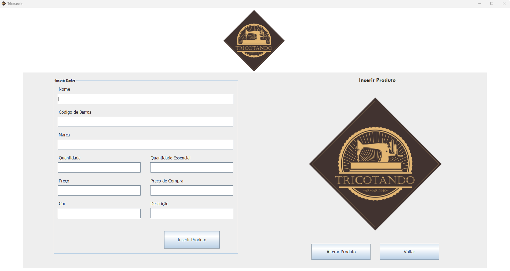
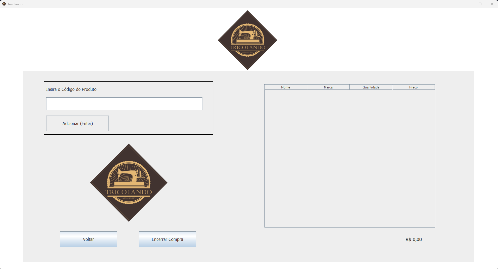
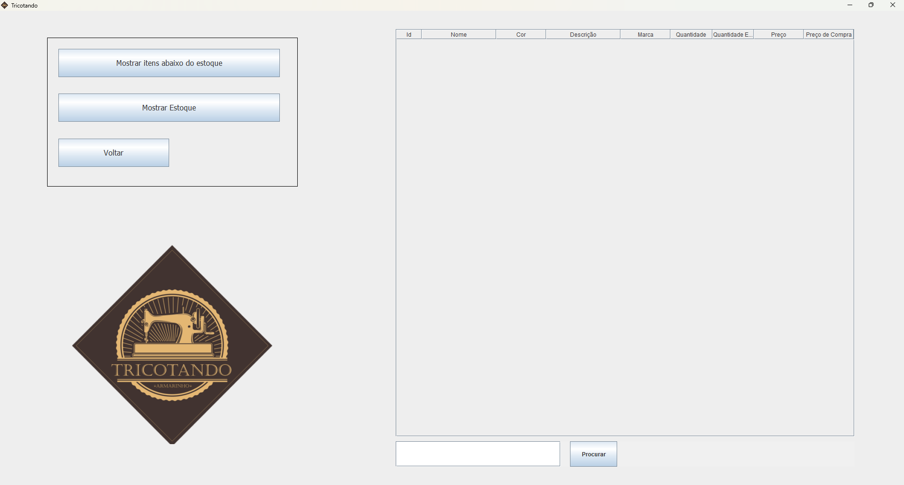

# Tricotando Armarinho - Sistema de Controle de Estoque

## 📌 Sobre o Projeto
O **Tricotando Armarinho** é um sistema de controle de estoque desenvolvido para a loja **Tricotando Armarinho**, com o objetivo de facilitar a gestão de produtos e vendas. O sistema, desenvolvido em **Java** com interface gráfica baseada em **JFrame e JTable**, garante que o estoque seja atualizado automaticamente conforme novas vendas são registradas.

## 🛠️ Tecnologias Utilizadas
- **Java (Swing, JDBC)** → Interface gráfica e manipulação de banco de dados
- **MySQL** → Banco de dados para armazenar produtos, vendas e estoque
- **JQuery** → Auxílio na manipulação de requisições ao banco de dados

## ⚙️ Funcionalidades
✅ Cadastro e edição de produtos no estoque  
✅ Registro de vendas com atualização automática do estoque  
✅ Interface responsiva com **JTable** para visualização dos produtos  
✅ Conexão com banco de dados **MySQL** via **JDBC**  

## 🏗️ Estrutura do Banco de Dados
O script SQL necessário para criar as tabelas e popular os dados iniciais está disponível no arquivo `banco_de_dados.sql` na raiz do repositório.

## 🚀 Como Executar o Projeto
1. **Configurar o MySQL**: Criar as tabelas necessárias e importar os dados iniciais.
2. **Configurar a Conexão JDBC**: Atualizar as credenciais do banco no código-fonte.
3. **Compilar e Executar**: Rodar o projeto no **Eclipse** ou **IntelliJ**

## 📸 Capturas de Tela
### 📍 Tela Principal

### 📍 Tela de Cadastro de Produto

### 📍 Tela de Registro de Vendas

### 📍 Tela de Exibição de Estoque

## 📜 Licença
Este projeto foi desenvolvido para fins de estudo e aprimoramento. Sinta-se à vontade para utilizá-lo e modificá-lo conforme necessário.

---
✉️ **Contato:** Para dúvidas ou sugestões, entre em contato!
